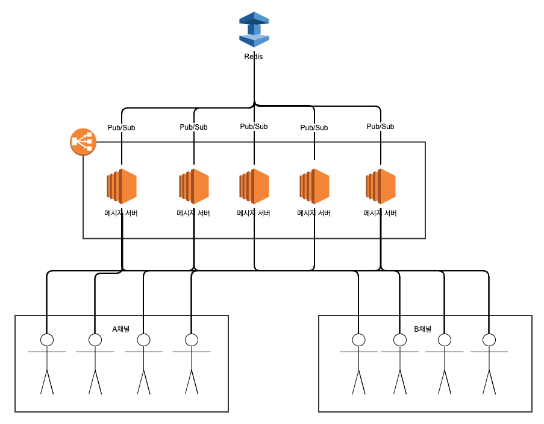
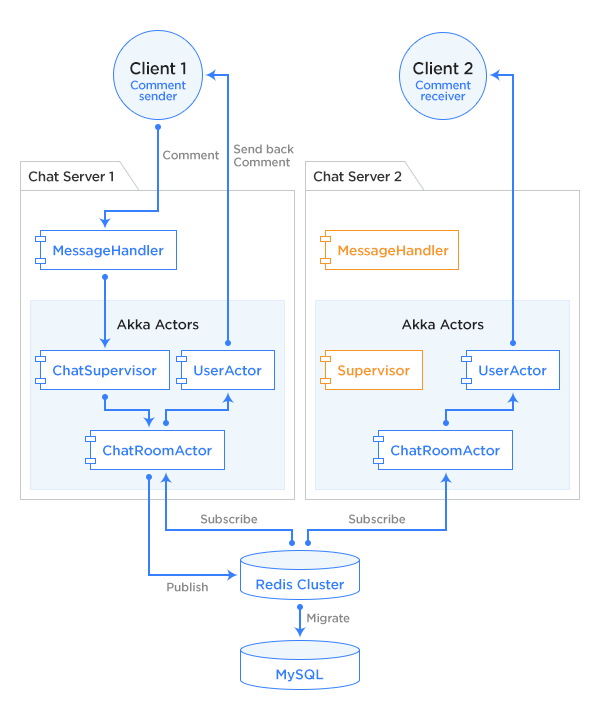

# 메시지 서버 아키텍처와 Spring Boot 구현체

## 아키텍처

> **참고자료**
>
> - 우아한형제들 기술블로그 [배민쇼핑라이브를 만드는 기술: 채팅 편](https://techblog.woowahan.com/5268/)
> - LINE Engineering [LINE LIVE 채팅 기능의 기반이 되는 아키텍처](https://engineering.linecorp.com/ko/blog/the-architecture-behind-chatting-on-line-live/)

### 1. 우아한형제들의 '배민쇼핑라이브'

#### 1) Webflux

메시지 서버는 Webflux를 통해 Single-thread, Non-blocking으로 동작하고 있습니다.

> **Webflux와 Reactive 프로그래밍**
>
> - [우아한형제들 기술블로그: 3월 우아한 Tech 세미나 후기](https://techblog.woowahan.com/2619/)
> - [YouTube 메타코딩: Springboot WebFlux 강좌](https://www.youtube.com/playlist?list=PL93mKxaRDidFH5gRwkDX5pQxtp0iv3guf)

#### 2) Redis

각 메시지 서버는 Redis의 Pub/Sub 기능을 통해 메시지를 주고받을 수 있습니다.

> **Redis의 Pub/Sub 기능**
>
> Redis의 특정 Channel에 메시지를 Publish하면,
> 해당 Channel을 Subscribe하고 있는 다른 클라이언트들이 메시지를 전달받게 됩니다.
> [자세히](https://brunch.co.kr/@springboot/374)

### 2. 라인의 'LINE LIVE'

#### 1) Akka

Akka는 Actor 모델을 구현한 라이브러리입니다.

Actor 모델은 Multi-thread 프로그래밍에서 발생하는 공유 자원 문제 등을 해결해 멀티 코어 프로세서 환경을 더 효율적으로 활용할 수 있도록 하는 모델입니다. [자세히](https://blog.rajephon.dev/2018/11/25/akka-00/)

#### 2) Redis

역시 Redis의 Pub/Sub 기능을 통해 메시지를 동기화하고 있는데, Standalone이 아니라 Redis Cluster로 구성되어 있습니다.

Redis에서 제공하는 Cluster 기능을 통해 각기 다른 Redis 서버를 묶어 하나의 시스템처럼 동작시킬 수 있습니다. 이는 트래픽의 분산으로 이어져 메시지 유입이 많아져도 고성능의 Read/Write가 가능하도록 합니다. [자세히](https://daddyprogrammer.org/post/1601/redis-cluster/)

추가적으로 Redis는 기본적으로 In-memory DB이기 때문에, 라이브 송출 이후에는 MySQL에 데이터를 저장합니다.

### 3. 정리

#### 1) 두 아키텍처의 공통점

Redis의 Pub/Sub 기능을 통해 메시지를 동기화한다는 점이 일치합니다. LINE에서 가용성 향상을 위해 구성한 Redis Cluster 또한 도입을 고려해봐도 좋을 것 같습니다.

#### 2) 두 아키텍처의 차이점

우아한형제들에서 Webflux를 통해 Single-thread, Non-blocking 메시지 서버를 구성한 것과 LINE에서 Akka의 Actor 모델을 도입해 Multi-thread 효율을 높인 것이 대비되는 솔루션인 것 같습니다.

개인적으로 LINE의 솔루션에서 궁금한 부분은 멀티 코어 환경의 효율을 높이는 방법이라는 점을 생각해보면, 높은 비용을 들여 코어를 충분히 늘려야 효과를 볼 수 있지 않을까 하는 점입니다. 이에 대해서는 아직 구체적인 답을 찾지 못했습니다.

단순참고용으로, 모 블로거가 20만개의 데이터를 갖고 테스트해본 결과로는 Akka를 활용했을 때 속도가 좀 더 빨랐다고 합니다. 두 방법에 대한 필자의 평은 다음과 같습니다. [자세히](https://edsonmcz.blogspot.com/2019/05/akka-vs-spring-reactor-personal.html)

- **Akka**
  - Best performance
  - Higher data load support
  - Faster
- **Webflux**
  - Ease of implementation
  - Greater Productivity in Developing
  - Ease of maintenance

## Spring Boot 구현체
